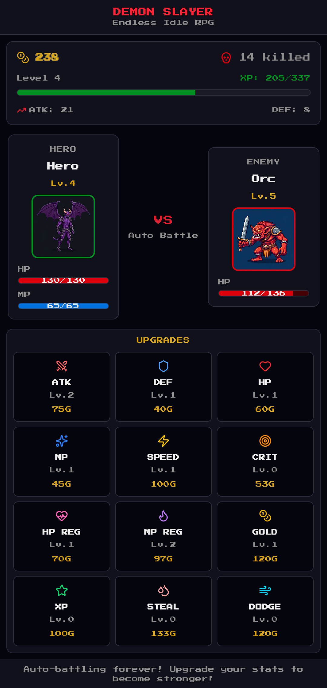
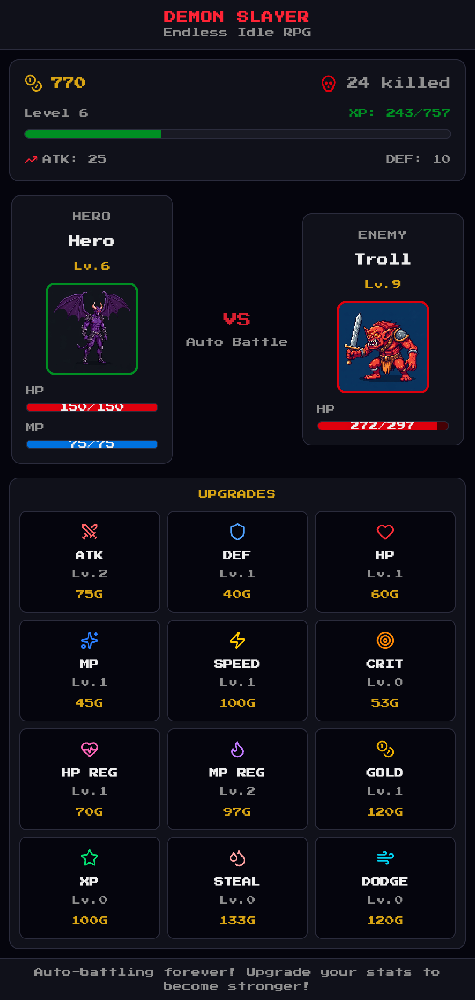
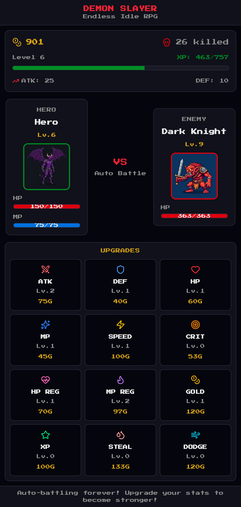
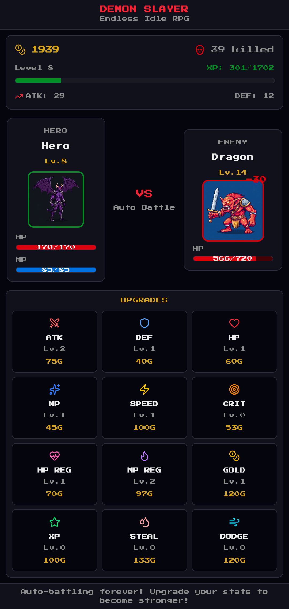

# Endless Idle RPG

**Endless Idle RPG** is an offline idle RPG game for Android.

## Download

Download the game on Google Play:

<https://play.google.com/store/apps/details?id=com.ae.endlessidlerpg>

## About

Fight scaling enemies, earn gold and XP, upgrade your hero, and keep progressing with save data stored locally on your device. The game is designed to work without an internet connection.

## Privacy Policy

Read the privacy policy here:

<https://alperugurca.github.io/endlessidlerpg/#privacy>

Privacy summary:

- The app does not collect personal data.
- The app does not sell or share personal data.
- Game progress is stored locally on your device.
- The Android app does not request `android.permission.INTERNET`.
- The app does not include analytics or advertising SDKs.

## Package

```text
com.ae.endlessidlerpg
```

## Screenshots

<table>
  <tr>
    <th>Combat</th>
    <th>Upgrades</th>
  </tr>
  <tr>
    <td></td>
    <td></td>
  </tr>
  <tr>
    <th>Progress</th>
    <th>Stats</th>
  </tr>
  <tr>
    <td></td>
    <td></td>
  </tr>
</table>
